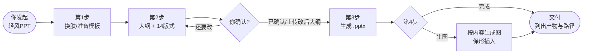
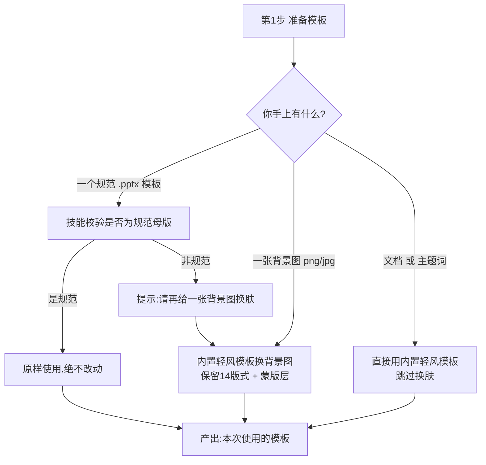
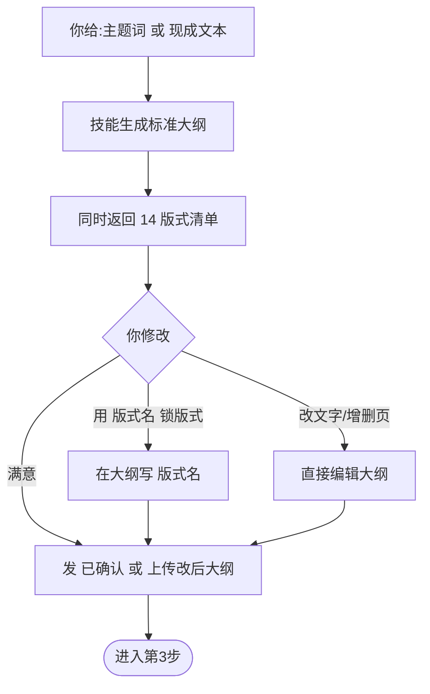
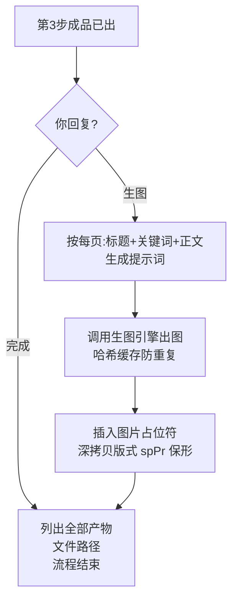
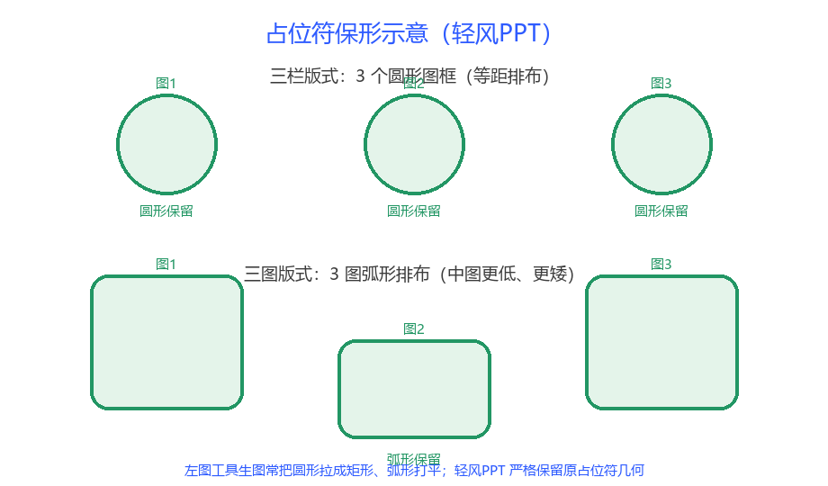

# 轻风PPT（qingfeng-ppt）技能说明

## 一、为什么要做这个技能

做 PPT 这件事，市面上已有的方案基本都试过，体验都不好，核心症结是**"AI 在替你做设计决定，而设计决定权本该在你手里"**：

- **从零生成的 AI PPT 工具**：版式、配色、字体全由模型临时发挥，结果要么千篇一律、要么花哨不专业；最关键的是，你手上那套企业 / 个人规范模板完全用不上，风格不可控、不可复用。
- **所谓"套模板"的工具**：大多只是把文字丢进一个通用版式，无视你模板里精心设计的版式语义（封面 / 目录 / 节 / 分栏的区分）；更糟的是，它们换图时往往用一张矩形图直接覆盖，**把你模板里圆形、弧形排布、异形印章等设计全部毁掉**；还有不少工具把文字色写死成白字，浅色背景上一片惨白看不清。
- **自动生图**：多数工具生完图就把占位符形状丢了，圆形变方形、弧形被打平。

所以没有再去寻找"更好的生成器"，而是换了个思路——**让 AI 只做"套版"这一件事，把"你的模板样式"当作唯一真理源**。模板长什么样、圆形还是弧形、黑字还是白字，全由模板决定；AI 负责的是换肤、写大纲、把文字灌进去、以及可选地把图生好插回去，且插回去时**严格保持原占位符的形状**。这就是轻风PPT。

## 二、这个技能是什么（它和别的技能哪里不同）

轻风PPT 是一个**"模板套版"型** PPT 生成技能，和你见过的"AI 从零画 PPT"是两条路线：

| 维度 | 通用 AI 生 PPT（从零生成） | 轻风PPT（套版） |
|------|------|------|
| 版式来源 | AI 临时设计，不可控 | 你的模板，100% 由你定 |
| 风格一致性 | 每次不同 | 与你的规范模板完全一致 |
| 文字颜色 | 常写死 / 随机 | 按背景亮度自动选黑 / 白字 |
| 图片占位符 | 常被改成矩形 | 圆形 / 弧形 / 异形**原样保留** |
| 过程可控性 | 黑盒一次出 | 大纲 + 版式确认后才生成 |

它的鲜明特征：

1. **换肤而非重设计**：第 1 步只读你模板的母版背景图 + 主题配色，套到内置的 14 版式骨架上，**版式结构、占位符几何一律不动**；规范模板则原样直接用，绝不破坏。
2. **文字色由背景亮度决定**：换肤后按母版平均亮度自动选色——浅底黑字、深底白字，彻底解决"套上去白字看不清"。
3. **大纲可改、版式可锁定**：第 2 步生成大纲后，会把模板的 **14 个版式**一并返回，你可以为每一页指定 / 锁定版式，确认后才进第 3 步，过程完全可控。
4. **纯灌文字、零样式破坏**：第 3 步只用模板的原生文本占位符灌字，绝不新建文本框、不改位置 / 大小 / 颜色 / 字号。
5. **可选自动生图且严格保形**：第 4 步按每页内容生成图片并插入所有图片占位符，且**模拟"在占位符上手动插图"**——椭圆、弧形排布、异形特效全部保留。
6. **自带 14 版式规范骨架**：没有模板也能直接用内置轻风模板出片。

## 三、怎么用（四步流程详解）

**启动**：对话里出现 `qingfeng-ppt` / `轻风PPT` 等关键词即触发，先回复欢迎语，然后按下面四步走。

> 欢迎语：欢迎使用轻风PPT，若要生成个性化的PPT，请上传一个规范PPT模板。也可上传一张背景图片，对内置模板进行改变背景设置。若使用内置模板，直接上传文档或PPT主题。

### 整体流程一览

四步的核心分工：**第 1 步决定"用什么模板"，第 2 步决定"每页讲什么、用什么版式"，第 3 步把文字灌进去，第 4 步（可选）把图补上**。第 2 步必须你点头（"已确认"）才进第 3 步，绝不会自作主张出片。

---

### 第 1 步 · 换肤（准备模板）

这一步解决"本次 PPT 用哪套模板"。按你手上的材料走不同分支：

| 分支 | 你给什么 | 技能做什么 | 关键产出 / 注意 |
|------|---------|-----------|----------------|
| **A 自带规范模板** | 一个 `.pptx` 规范模板 | 校验母版是否规范（看有无"输入关键词"签名框、≥4 个标题版式等）；规范则**原样使用，一像素都不改** | 本次模板。非规范模板会提示你改给背景图走 B |
| **B 只用背景图** | 一张图（png/jpg） | 只把内置轻风模板的**母版背景图**替换成这张图，14 版式结构、蒙版层、装饰一律不动 | 换肤后模板。浅图自动黑字、深图保留白字 |
| **C 内置模板** | 文档（docx/txt/md）或一句主题词 | 直接用内置轻风模板，**跳过换肤** | 内置模板（14 版式规范骨架） |

**你的动作与示例话术：**
- 分支 A：「用这个模板帮我做 PPT」（附 `你的模板.pptx`）
- 分支 B：「把这个背景图套到内置模板」（附 `背景.png`）
- 分支 C：「帮我做一个关于《新课标下跨学科学习》的 PPT」 —— 直接给主题即可，连模板都不用传

**注意**：换肤只换"母版背景 + 主题色"，**绝不会重排版式、不会把你模板的圆形/弧形占位符拉直**。你上传的规范模板会被完整保留。

---

### 第 2 步 · 大纲 + 版式确认

这一步决定"每页讲什么、用哪个版式"，且**必须你确认后才出片**。

**你给什么：**
- 一句**主题词**（如"新课标下跨学科主题学习"）→ 我帮你扩写成完整大纲；
- 或一份**现成文本/文档** → 我整理成标准大纲（保留你的原意）。

**我返回什么：**
1. 一份标准大纲，结构为：`# 大标题` → `[节标题]` → `# 节名` → `## 页标题` + 要点；
2. 模板的 **14 个版式**清单（序号 / 名称 / 适用场景，见下表），供你为每页锁定版式。

**你怎么改（完全可控）：**
- **锁版式**：在大纲里写 `[版式名]`，例如 `[三栏]` `[右图左文]`，这页就固定用该版式；不写则按内容自动选；
- **改文字**：直接编辑大纲内容；
- **增删页**：加 `## 页标题` 即加页，删掉即减页。

**确认指令（二选一）：**
- 本地直接回复 **"已确认"**；
- 或把修改后的大纲**作为文件上传**。

> 这一步不确认，技能不会进入第 3 步，你随时可以反复改到满意。

**14 版式速览（第 2 步返回的就是它）：**

| 序号 | 版式名 | 适合场景 | 标注写法 |
|------|--------|---------|---------|
| 1 | `00_Cover_封面` | 封面：标题 + 副标题 | `[封面]` |
| 2 | `01_TOC_目录` | 目录：章节列表 | `[目录]` |
| 3 | `02_SectionHeader_节标题` | 章节过渡 / 分隔页 | `[节标题]` |
| 4 | `14_单栏` | 单要点内容 / 引言 / 过渡 | `[单栏]` |
| 5 | `04_Title_Content_2Col_两栏` | 2 个要点并排 | `[两栏]` |
| 6 | `05_Title_Content_3Col_三栏` | 3 个要点并排（图框为**圆形**） | `[三栏]` |
| 7 | `06_Title_ImgLeft_TextRight_左图右文` | 左图右文 | `[左图右文]` |
| 8 | `07_Title_TextLeft_ImgRight_右图左文` | 右图左文 | `[右图左文]` / `[左文右图]` |
| 9 | `08_Title_ImageFull_大图` | 全屏大图 + 标题 | `[大图]` |
| 10 | `09_Title_4Images_四图` | 4 图网格 | `[四图]` |
| 11 | `10_Title_3Images_三图` | 3 图网格（**弧形排布**） | `[三图]` |
| 12 | `12_四栏` | 4 个要点并排 | `[四栏]` |
| 13 | `13_六栏` | 6 个要点并排 | `[六栏]` |
| 14 | `11_Blank_空白` | 自定义空白页 | `[空白]` |

---

### 第 3 步 · 生成成品

**触发**：你发了"已确认"或上传改后大纲。

**我做什么**：严格按大纲，把文字**纯灌入**模板的原生文本占位符——**不新建文本框、不改位置 / 大小 / 颜色 / 字号**。图片占位符此时**留空**（显示"插入图片"提示），等你在 PowerPoint 手补，或走第 4 步自动生图。

**产出**：一份 `.pptx` 成品（与你的模板风格 100% 一致）。

**固定结束语**（第 3 步完成后我会说）：
> PPT已生成，为突出PPT的真实性，占位图片请自行补充。也可让我自动根据PPT内容生成图片。请回复"完成"或"生图"。

---

### 第 4 步 · 补图（可选，回复"生图"）

- 回复 **"完成"** → 我列出全部产物文件及存放地址，流程结束（图片占位符留空，你手动补）。
- 回复 **"生图"** → 我按每页的"页标题 + 关键词 + 正文"生成图片，并插入到对应图片占位符，然后回到"完成"分支列产物。

**为什么叫"保形"插入（这是本技能的关键差异点）：**

很多工具生完图就把占位符形状丢了——圆形变方形、弧形被打平。轻风PPT 严格模拟"你在占位符上手动插图"：

| 版式 | 占位符原样式 | 生图后 |
|------|------------|--------|
| `三栏` | 3 个**圆形**图框 | 3 张图仍是**圆形**，等距排布 ✅ |
| `三图` | 3 个图框**弧形**排布（中图更低更矮） | 弧形排布**原样保留** ✅ |
| `右图左文` / `左图右文` | 单侧图框 | 图落在正确一侧 ✅ |
| `封面`等异形 | 异形印章 / 圆角 | 异形特效**原样保留** ✅ |

原理：插入时直接复用版式占位符的 `spPr`（几何、旋转、位置、描边、3D 特效全部原样带过来），只把图片内容指向新生成的图，所以**版式设计零丢失**。

**说明**：自动生图默认调用本机的 `agnes-image 2.1` 生图技能（需另装并配置 Key）；若没装，前 3 步仍可正常出 PPT，图片占位符留空由你手补即可。

---

### 常见问题

- **我没有任何模板？** → 走分支 C，直接用内置轻风模板，连模板都不用传。
- **想换配色 / 字体？** → 上传一份含你配色字体的规范 `.pptx` 模板（分支 A），或上传一张背景图（分支 B）换肤。
- **某张图生成失败？** → 该张留空、告警但不崩，其余正常插入，你可在 PowerPoint 手动补那一张。
- **想换某一页的图？** → 第 4 步生图后，在 PowerPoint 里选中该占位符重插即可；或告诉我"第 X 页换图"重新生成。
- **版式选错了？** → 第 2 步用 `[版式名]` 锁定；已出片才发现，回第 2 步改标注重跑最快。

## 四、技能清单

| 类别 | 文件 | 说明 |
|------|------|------|
| 技能说明 | `SKILL.md` | 技能触发与四步工作流（给 AI 读的执行说明） |
| 部署说明 | `README.md` | 新环境三步部署 + 依赖说明 |
| 依赖清单 | `requirements.txt` | python-pptx / Pillow / lxml |
| 核心脚本 | `scripts/restyle_template.py` | 第 1 步换肤 |
| 核心脚本 | `scripts/list_layouts.py` | 第 2 步辅助，读出 14 版式 |
| 核心脚本 | `scripts/build_ppt.py` | 第 3 步按大纲灌文字生成成品 |
| 核心脚本 | `scripts/fill_images.py` | 第 4 步自动生图并保形插入 |
| 校验脚本 | `scripts/validate_outline.py` | 大纲结构校验 |
| 内置模板 | `assets/轻风模板_规范版.pptx` | 14 版式规范骨架（默认母版） |
| 参考资料 | `references/OUTLINE_TEMPLATE.md` | 大纲标注模板 |
| 参考资料 | `references/大纲标注说明.md` | 版式标注说明 |
